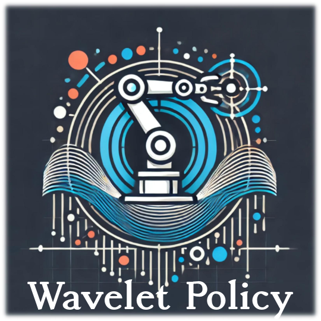
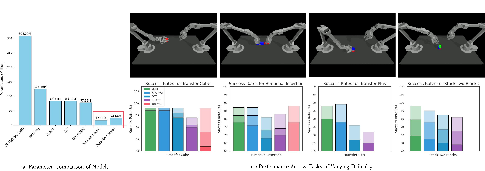
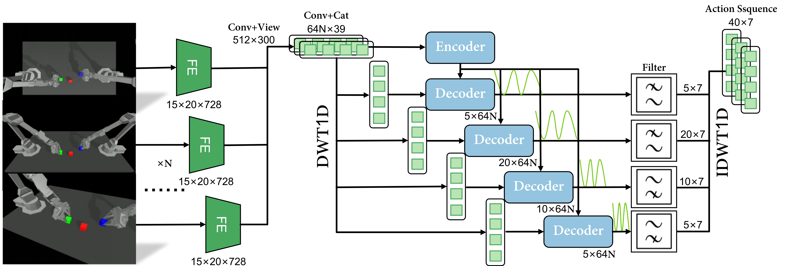

<a name="readme-top"></a> <br />

<div align="center">
  <a href="https://github.com/lurenjia384/Wavelet_Policy">
    
  </a>

  <h3 align="center">Wavelet Policy</h3>

  <p align="center">
    Imitation Policy Learning in the Frequency Domain with Wavelet Transforms  
    <br />
    <a href="https://www.youtube.com/watch?v=Dv1V4F4sflc">Quick-Start Demo</a>
    ·
    <a href="https://arxiv.org/pdf/2504.04991">Paper</a>
    ·
    <a href="https://www.youtube.com/watch?v=ak8riKGEG0s">Presentation Video</a>
  </p>
</div>

# Wavelet Policy

<p align="center"></p>

> 🔍 **Abstract:**
> Most imitation learning policies treat the problem as a time-series prediction task, directly mapping high-dimensional observations—such as visual input and proprioception—into action space. While time-series methods focus on spatial-domain modeling, they often overlook inherent temporal patterns in action sequences. To address this, we recast imitation learning policies in the frequency domain and propose **Wavelet Policy**. Our approach applies discrete wavelet transforms (WT) for feature preprocessing, then uses a Single-Encoder-Multiple-Decoder (SE2MD) architecture to extract multi-scale frequency-domain features. To further enrich feature mapping and boost capacity, we insert a Learnable Frequency-Domain Filter (LFDF) after each frequency decoder, improving robustness under varying visual conditions. Experiments show that Wavelet Policy outperforms state-of-the-art end-to-end methods by over 10 % across four challenging robotic-arm tasks while keeping model size comparable. In long-horizon settings, its performance degrades more gracefully as task complexity increases. The code will be released publicly.

---

## 📝 Striving for a Simple and Efficient Embodied Intelligence Model

<p align="center"></p>

---

## 💻 System Requirements

| Component        | Requirement                              |
| ---------------- | ---------------------------------------- |
| Operating System | Ubuntu 20.04                             |
| GPU Memory       | Training: ≥ 4 GB; Inference: ≥ 2 GB      |
| Disk Space       | 100–200 GB (datasets)                    |
| GPU Support      | NVIDIA GPU with CUDA support recommended |

> 📌 For detailed hardware specs, see the “Experimental Setup” section in the paper.

---

## ⚙️ Environment Configuration

We recommend using a `conda` environment. Quick install steps:

```bash
git clone https://github.com/lurenjia384/Wavelet_Policy
cd Wavelet_Policy

# Create conda environment
conda create -n Wavelet_Policy python=3.7.16 -y
conda activate Wavelet_Policy

# Install dependencies
pip install -r requirements.txt
```

---

## 📁 Project Structure

```bash
Wavelet_Policy/
├── images              # Images for GitHub display
├── pre_model           # Pretrained models
├── log                 # Log files
├── assets              # Robot fixtures or CAD assets
├── pytorch_wavelets    # Wavelet transform utilities
├── vid_path            # Saved inference videos
├── infer.py            # Inference script
├── model.py            # Network definitions
├── utils.py            # Configuration and helper code
├── requirements.txt    # Python dependencies
├── LICENSE
└── README.md
```

---

## 🔗 Pre-trained Model Download

Pre-trained weights and configurations are available on Hugging Face:

👉 [WaveletPolicy-base](https://huggingface.co/lurenjia384/wavelet_policy_model)

| Cameras |       Dataset      | Params (M) | Download (closed)                                                                                                                |
| :-----: | :----------------: | :--------: | :------------------------------------------------------------------------------------------------------------------------------- |
|   One   |    Transfer Cube   |    17.22   | [best\_model\_11.pt](https://huggingface.co/lurenjia384/wavelet_policy_model/resolve/main/task_1/best_model_11.pt?download=true) |
|   Two   |    Transfer Cube   |      —     | coming soon                                                                                                                      |
|   One   | Bimanual Insertion |    17.22   | coming soon                                                                                                                      |
|   Two   | Bimanual Insertion |      —     | coming soon                                                                                                                      |
|   One   |    Transfer Plus   |    17.22   | [best\_model\_13.pt](https://huggingface.co/lurenjia384/wavelet_policy_model/resolve/main/task_3/best_model_13.pt?download=true) |
|   Two   |    Transfer Plus   |      —     | coming soon                                                                                                                      |
|   One   |  Stack Two Blocks  |    17.22   | coming soon                                                                                                                      |
|   Two   |  Stack Two Blocks  |      —     | coming soon                                                                                                                      |

After downloading, place the model files under:

```
Wavelet_Policy/
├── pre_model
```

You can also load models directly with `huggingface_hub` (no need for `--netdir` or `--stats_path`):

```python
from huggingface_hub import hf_hub_download

model_path = hf_hub_download(
    repo_id="lurenjia384/wavelet_policy_model",
    filename="task_3/best_model_13.pt"
)
stats_path = hf_hub_download(
    repo_id="lurenjia384/wavelet_policy_model",
    filename="task_3/task_3.pkl"
)
```

---

## 🚀 Quick Start

**Run inference:**

```bash
python infer.py --task_name {task_name} \
                --stats_path {data_pkl_path.pkl} \
                --netdir {model_path.pt} \
                --no_visualization {0|1}
```

**Example** (Transfer Plus task, with visualization enabled):

```bash
python infer.py --task_name sim_transfer_cube_scripted_plus --no_visualization 0
```

Other valid values for `--task_name` are:

* `sim_transfer_cube_scripted` — Transfer Cube
* `sim_insertion_scripted` — Bimanual Insertion
* `Put` — Stack Two Blocks

**Train the model:**
Coming soon…

---

## 📊 Experimental Results

**Table:** Success rates (%) of Wavelet Policy vs. five baselines across four tasks and three stages

| Model     |   TC-1 |   TC-2 |   TC-3 |   BI-1 |   BI-2 |   BI-3 |   TP-1 |   TP-2 |   TP-3 |   ST-1 |   ST-2 |   ST-3 |
| --------- | -----: | -----: | -----: | -----: | -----: | -----: | -----: | -----: | -----: | -----: | -----: | -----: |
| DP (DDIM) |      9 |      6 |      4 |      4 |      3 |      1 |      2 |      1 |      1 |      1 |      1 |      1 |
| ACT       |     98 |     96 |     94 |     81 |     73 |     68 |     66 |     57 |     57 |     85 |     67 |     50 |
| NL-ACT    |     94 |     91 |     90 |     83 |     74 |     70 |     62 |     55 |     55 |     82 |     65 |     48 |
| HACT-Vq   |     98 |     98 |     97 |     87 |     82 |     76 | **79** |     68 |     68 |     90 |     76 |     55 |
| InterACT  | **98** |     88 |     82 | **88** |     78 |     44 |      — |      — |      — |      — |      — |      — |
| Ours      |     98 | **98** | **97** |     87 | **82** | **78** |     78 | **70** | **70** | **96** | **79** | **59** |

> **Note:** Bold entries denote the best performance in each column.
> `—` indicates no experiment for that method.
> `TC`: Transfer Cube; `BI`: Bimanual Insertion; `TP`: Transfer Plus; `ST`: Stack Two Blocks.
> The number after each task name indicates the stage.
> See the paper for full experimental details.

---

## 📬 Contact

If you encounter any issues, please open an [issue](https://github.com/lurenjia384/Wavelet_Policy/issues) or email the author:

* 📧 [ccyang@zjut.edu.cn](mailto:ccyang@zjut.edu.cn)

As mentioned in the paper’s conclusion, we will continue to improve the model and advance real-robot validation ⭐.

We welcome feedback and collaboration opportunities 📫.

---

## ❤️ Acknowledgments

We gratefully acknowledge the following resources and contributors:

1. **[DISCOVER Robotics](https://air.tsinghua.edu.cn/info/1147/2175.htm)** — An open platform for Embodied Artificial Intelligence research.
2. **[ACT](https://github.com/tonyzhaozh/act)** — Used for baseline data generation.
3. **[pytorch\_wavelets](https://github.com/fbcotter/pytorch_wavelets)** — Wavelet transform utilities.
4. **[ZJU](https://pi.zju.edu.cn/)** — Support from the graduate school.
5. **[ZJUT](https://ie.zjut.edu.cn/)** — Support from my alma mater.

Special thanks to my senior colleagues and advisor for their guidance and contributions.
Thanks to all contributors and supporters who help us improve this project!

---

## 🔗 BibTeX Citation

```bibtex
@article{yang2025wavelet,
  title   = {Wavelet Policy: Imitation Policy Learning in Frequency Domain with Wavelet Transforms},
  author  = {Yang, Changchuan and Dong, Yuhang and Tian, Guanzhong and Ge, Haizhou and Zhu, Hongrui},
  journal = {arXiv preprint arXiv:2504.04991},
  year    = {2025}
}
```
